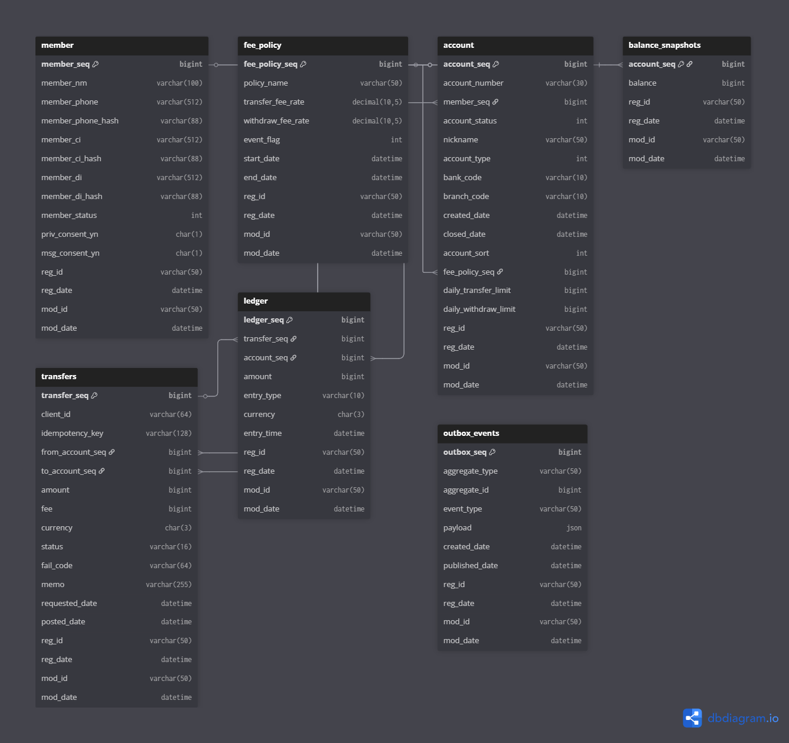

# 🎉 Remittance Service (송금 서비스)
> 계좌 기반 송금 시스템 — Spring Boot · JPA · Docker Compose

<p align="center">
  
</p>

<p align="center">
  <a href="https://www.java.com/"></a>
  <a href="https://spring.io/"></a>
  <a href="https://hibernate.org/orm/"></a>
  <a href="https://www.mysql.com/"></a>
  <a href="https://www.docker.com/"></a>
</p>

---

## 📑 Table of Contents

- [📘 프로젝트 소개](#-프로젝트-소개)
- [🛠 기술 스택](#-기술-스택)
- [📦 프로젝트 구조](#-프로젝트-구조)
- [🧩 ERD 다이어그램](#-erd-다이어그램)
- [🚀 실행 방법 (Docker Compose)](#-실행-방법-docker-compose)
- [📚 API 문서](#-api-문서)
- [📦 외부 라이브러리 및 오픈소스 사용 목적](#-외부-라이브러리-및-오픈소스-사용-목적)
- [📝 코딩테스트 요구사항 매핑](#-코딩테스트-요구사항-매핑)
- [⚙ 설계 및 확장성 고려](#-설계-및-확장성-고려)
- [🧪 테스트 코드](#-테스트-코드)

---

## 📘 프로젝트 소개

본 프로젝트는 코딩테스트 과제로 제시된 **계좌 간 송금 서비스(Remittance)** 를 설계하고 구현한 것입니다.

### ✨ 주요 기능

- 계좌 등록 / 삭제
- 입금 / 출금 / 계좌 간 이체
- 일일 한도 체크
    - 출금: 1일 최대 **1,000,000원**
    - 이체: 1일 최대 **3,000,000원**
- 이체 수수료 계산
    - 이체 금액의 **1%** 를 수수료로 부과
- 거래내역(송금/수취) 조회 (최신순 정렬)
- 예외 처리 및 기본적인 검증 로직 포함
- Docker Compose 기반 실행 환경 제공
- OpenAPI 기반 API 문서(Swagger UI + ReDoc) 제공

---

## 🛠 기술 스택

| 구분 | 기술 |
|------|------|
| Language | Java 17 |
| Framework | Spring Boot 3.3.x, Spring Web, Spring Data JPA |
| Database | MySQL 8.x |
| Migration | Flyway |
| Build Tool | Maven |
| Container | Docker, Docker Compose |
| Documentation | SpringDoc OpenAPI (Swagger UI), ReDoc, 정적 API 문서 (`docs/api`) |
| Test | JUnit5, Spring Boot Test |
| ETC | Lombok |

---

## 📦 프로젝트 구조

> 실제 현재 레포지토리 구조 기준으로 정리했습니다.

```bash
📁 프로젝트 루트
├── .gitattributes
├── .gitignore
├── Dockerfile
├── docker-compose.yml
├── pom.xml
├── README.md              # (이 파일)
├── docs/                  # API 문서 및 ERD, OpenAPI 스펙
│   ├── api/
│   │   └── index.html     # 정적 API 문서 메인 페이지
│   ├── appendix/
│   │   ├── errors.md
│   │   └── fail-codes.md
│   ├── erd-remittance.png.png  # ERD 이미지
│   ├── getting-started/
│   │   ├── auth.md
│   │   └── sandbox.md
│   ├── guides/
│   │   ├── account-guide.md
│   │   ├── transfer-flow.md
│   │   └── transfer-guide.md
│   ├── index.md           # Remittance API 개요 문서
│   ├── openapi.json       # OpenAPI 3.0 스펙 (export)
│   └── styles/
│       └── api.css
├── site/                  # 정적 문서 사이트 빌드 산출물
├── src/
│   ├── main/
│   │   ├── config/
│   │   │   ├── application.yml
│   │   │   ├── application-dev.yml
│   │   │   ├── application-docker.yml
│   │   │   └── banner.txt
│   │   ├── java/
│   │   │   └── io/dnrdl12/remittance/
│   │   │       ├── RemittanceApplication.java
│   │   │       ├── comm/
│   │   │       │   ├── api/         # 공통 응답, 페이징 등
│   │   │       │   ├── config/      # SwaggerConfig, JPA, 프로퍼티 등
│   │   │       │   ├── crypto/      # 암복호화 컨버터
│   │   │       │   ├── entity/      # BaseEntity 등 공통 엔티티
│   │   │       │   ├── enums/       # 공통 Enum (에러코드, 상태 등)
│   │   │       │   ├── exception/   # 공통 예외 및 핸들러
│   │   │       │   └── utills/      # 유틸리티 (마스킹 등)
│   │   │       ├── controller/      # 계좌/송금 관련 REST 컨트롤러
│   │   │       ├── converter/       # JPA AttributeConverter 등
│   │   │       ├── dto/             # 요청/응답 DTO
│   │   │       ├── entity/          # Account, Member, Transaction, FeePolicy 등
│   │   │       ├── projection/      # 조회용 Projection
│   │   │       ├── repository/      # JPA Repository
│   │   │       ├── service/         # 비즈니스 로직 (입금/출금/이체 등)
│   │   │       └── spec/            # 동적 검색을 위한 JPA Specification
│   │   └── resources/
│   │       └── db/migration/        # Flyway 마이그레이션 스크립트
│   └── test/
│       └── java/                    # 단위/통합 테스트
└── target/                          # 빌드 산출물
```

---

## 🧩 ERD 다이어그램

### 📌 ERD 이미지

> ERD 이미지는 `docs/erd-remittance.png.png` 에 위치합니다.

<p align="center">
  
</p>

### 📌 ERD 원본 (dbdiagram.io)

dbdiagram에서 작성된 원본 ERD는 다음 링크에서 확인할 수 있습니다:

- https://dbdiagram.io/d/6912dcdf6735e11170325f61

---

## 🚀 실행 방법 (Docker Compose)

### 0️⃣ 사전 요구사항

- JDK 17+
- Docker, Docker Compose 설치

애플리케이션은 `docker-compose.yml` 기준으로 **Spring Boot 앱 + MySQL 컨테이너**를 함께 실행합니다.  
`SPRING_PROFILES_ACTIVE=docker` 프로파일로 실행되며, `src/main/config/application-docker.yml` 설정을 사용합니다.

---

### 1️⃣ 애플리케이션 빌드

루트 디렉토리에서:

```bash
./mvnw clean package -DskipTests
# 또는
mvn clean package -DskipTests
```

---

### 2️⃣ Docker Compose 실행

```bash
docker-compose up --build
```

- 애플리케이션: `http://localhost:8080`
- MySQL: `localhost:3306` (컨테이너 내부에서는 `db` 호스트 사용)

---

### 3️⃣ 종료

```bash
docker-compose down
```

---

## 📚 API 문서

이 프로젝트는 **실행 중인 API 문서**와 **정적 문서(docs 폴더)** 를 모두 제공합니다.

### ✔ 실행 중(API 서버 기준) 문서

- Swagger UI:  
  `http://localhost:8080/swagger-ui/index.html`
- ReDoc:  
  `http://localhost:8080/redoc.html`
- OpenAPI JSON:  
  `http://localhost:8080/v3/api-docs`

> 이 엔드포인트들은 `springdoc-openapi-starter-webmvc-ui` 에 의해 자동으로 제공됩니다.

---

### ✔ 정적 API 문서 (docs 폴더) 

- <a margin="30px" href="https://dnrdl12.github.io/remittance/" target="_blank">문서 확인 하기   </a>
- `docs/index.md` : Remittance API 개요
- `docs/api/index.html` : 정적 API 안내 페이지
- `docs/openapi.json` : OpenAPI 3.0 스펙 파일
- `docs/appendix/errors.md`, `docs/appendix/fail-codes.md` : 에러 코드/실패 코드 부록
- `docs/guides/*` : 계좌, 이체 흐름, 사용 가이드 문서

---

## 📦 외부 라이브러리 및 오픈소스 사용 목적

코딩테스트 지침의 **“외부 라이브러리 및 오픈소스 사용 가능 (사용 목적 명시)”** 조건에 따라, 주요 외부 라이브러리와 사용 목적을 다음과 같이 정리합니다.

### 🔹 SpringBoot / Spring Data JPA

- 의존성: `spring-boot-starter-web`, `spring-boot-starter-data-jpa`
- 목적:
    - RESTful API 구현
    - JPA/Hibernate 기반 ORM, 트랜잭션 관리

### 🔹 Flyway

- 의존성: `flyway-core`, `flyway-mysql`
- 목적:
    - DB 스키마 버전 관리 및 자동 마이그레이션
    - 초기 테이블 및 샘플 데이터 구성

### 🔹 MySQL JDBC Driver

- 의존성: `com.mysql:mysql-connector-j`
- 목적:
    - MySQL 데이터베이스 연결

### 🔹 Lombok

- 의존성: `org.projectlombok:lombok`
- 목적:
    - getter/setter, builder, constructor 등 보일러플레이트 코드 제거

### 🔹 SpringDoc OpenAPI + Swagger UI

- 의존성:
  ```xml
  <dependency>
      <groupId>org.springdoc</groupId>
      <artifactId>springdoc-openapi-starter-webmvc-ui</artifactId>
      <version>2.6.0</version>
  </dependency>
  ```
- 목적:
    - OpenAPI 3.0 기반 API 스펙 자동 생성
    - Swagger UI 제공(` /swagger-ui/index.html `)
    - `/v3/api-docs` 엔드포인트 제공 (ReDoc 및 기타 도구와 연동 가능)

### 🔹 ReDoc (ReDocly 오픈소스)

- 사용 방식:
    - 정적 HTML(`redoc.html`)에서 CDN 스크립트로 로딩
- 목적:
    - 읽기 중심의 정적 API 레퍼런스 제공
    - Swagger UI 대비 문서형(Documentation-centric) 뷰 제공

---

## 📝 코딩테스트 요구사항 매핑

코딩테스트에서 제시된 요구사항과 구현 내용을 매핑하면 다음과 같습니다.

### 1. 계좌 등록 / 삭제 API

- 새로운 계좌 등록
- 계좌 비활성화/삭제 처리
- 관련 엔티티: `Account`, `Member`
- 관련 계층:
    - `controller`: Account 관련 Controller
    - `service`: AccountService
    - `repository`: AccountRepository

### 2. 입금, 출금 및 이체 API

- **입금(Deposit)**: 특정 계좌에 금액 추가
- **출금(Withdraw)**:
    - 계좌 잔액 체크
    - 일 한도: 1일 최대 1,000,000원
- **이체(Transfer)**:
    - 출금 계좌 → 입금 계좌로 금액 이동
    - 수수료 1% 부과 (수수료 계좌 혹은 정책 테이블 참조)
    - 이체 일 한도: 3,000,000원

> 관련 도메인/로직은 `service` 레이어에서 구현되며, 원장/거래내역 엔티티를 통해 이력 관리가 이루어집니다.

### 3. 거래내역 조회 API

- 지정된 계좌의 송금/수취 내역 조회
- 최신순 정렬
- 페이징 처리 및 검색 조건 적용 (JPA Specification 사용)

---

## ⚙ 설계 및 확장성 고려

### ✔ 동시성 이슈 고려

- 계좌 잔액 변경 시 트랜잭션 경계 내에서 처리
- 필요 시 비관적 락(PESSIMISTIC_WRITE) 또는 낙관적 락 전략으로 확장 가능
- 원장(Ledger) 개념을 도입해 거래 내역과 실시간 잔액 싱크 유지

### ✔ 정책 확장

- 이체 수수료 및 한도 정책을 별도 테이블(예: `fee_policy`)로 분리
    - 현재는 1% 고정 수수료, 지정 한도이지만
    - 추후 회원 등급, 상품 유형, 채널에 따른 차등 수수료/한도로 확장 가능

### ✔ 멀티 모듈 아키텍처 확장 가능

현재는 단일 모듈 구조지만, 다음과 같이 확장 가능하도록 의존성을 최소화하여 설계함:

- `remittance-api` : Controller, DTO
- `remittance-domain` : Entity, Service, Repository
- `remittance-batch` : 정산/스케줄링/로그 집계

---

## 🧪 테스트 코드

### 테스트 구성

- `src/test/java` 이하에 Repository 및 Service 레벨 테스트 구성
- 주요 시나리오:
    - 계좌 생성 → 입금 → 출금 → 이체 플로우
    - 일일 한도 초과 케이스
    - 잔액 부족 예외 케이스

### 실행 방법

```bash
./mvnw test
# 또는
mvn test
```

---

## ✨ 마무리

이 레포지토리는 송금 서비스라는 도메인을 기반으로
핵심 기능 구현부터 API 명세 작성, 인프라 구성(Docker Compose)까지
하나의 흐름으로 이해할 수 있도록 구성된 프로젝트입니다.

또한, 서비스 확장성을 고려하여 계층 구조를 명확히 하고
수수료·한도·정책 등 변경 가능성이 높은 영역을 별도 도메인으로 분리할 수 있도록 설계하였습니다.
데이터 관계가 복잡해지거나 고도화된 조회·정산 로직이 필요해질 경우,
JPA 기반 구조 위에 MyBatis를 병행하여 사용함으로써
고성능 쿼리 처리 및 유연한 데이터 매핑을 지원하는 방향으로도 자연스럽게 확장할 수 있습니다.
